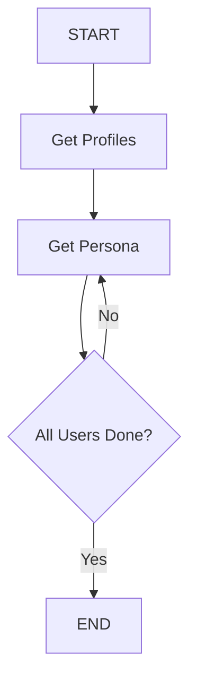

# User Persona Generator 🧑

An advanced LangGraph-powered application that generates comprehensive user personas for products and services using iterative processing and structured data extraction.

## 🎯 Overview

This project demonstrates sophisticated LangGraph patterns with **iterative loops** that:

1. **Extracts user types** from input using structured parsing
2. **Iteratively generates personas** for each user type
3. **Creates comprehensive profiles** with 13+ detailed sections
4. **Accumulates results** using annotated state management
5. **Provides actionable insights** for product development

## ✨ Features

- **Automated User Extraction**: Identifies user types from product descriptions
- **Iterative Processing**: Generates personas one by one using loops
- **Comprehensive Profiles**: 13-section detailed persona framework
- **Structured Data Handling**: Pydantic schemas for reliable parsing
- **Accumulative State**: Builds persona collection over iterations
- **Professional Framework**: Industry-standard persona template
- **Flexible Input**: Supports various product types and markets

## 🏗️ LangGraph Workflow



### Iterative Loop Architecture:

**Initialization Phase**: 
- Extract user types from input
- Set up iteration counter
- Initialize persona accumulator

**Iteration Phase**:
- Process one user type per iteration
- Generate comprehensive persona
- Increment counter and accumulate results
- Check termination condition

**Termination**: 
- Complete when all users processed
- Return accumulated persona collection

### Workflow Details:

1. **Get Profiles Node**:
   - Uses structured parsing to extract user types
   - Creates list of users from product/market descriptions
   - Sets up iteration parameters (count, counter)

2. **Get Persona Node** (Iterative):
   - Processes one user type per iteration
   - Generates 13-section comprehensive persona
   - Uses counter to track current user
   - Accumulates results in annotated list

3. **Iterator Function**:
   - Controls loop termination
   - Compares counter with total user count
   - Routes to END or continues iteration

## 📋 Persona Framework (13 Sections)

Each generated persona includes:

1. **Header/Basic Info** - Name, role, demographics
2. **Background/Context** - Biography, tech experience
3. **Goals & Motivations** - Objectives and drivers
4. **Behaviors & Preferences** - Usage patterns, preferences
5. **Pain Points/Challenges** - Frustrations and obstacles
6. **Needs** - Feature requirements and expectations
7. **Day in the Life** - Usage scenarios and touchpoints
8. **Quote/Voice** - Representative attitude statements
9. **Personality & Psychographics** - Traits and values
10. **Technical/Environmental Constraints** - Device/network limitations
11. **Preferred Channels** - Communication and discovery preferences
12. **Opportunities/Solution Ideas** - Design improvement suggestions
13. **Measuring Success** - Success metrics and KPIs

## 🚀 Getting Started

### Prerequisites

- Python 3.8+
- Hugging Face API access
- Internet connection for model access


### Running the Application

1. **Start the Streamlit app**
   ```bash
   streamlit run user_persona_generator.py
   ```

2. **Open your browser** to `http://localhost:XXXX`

3. **Fill in the required fields**:
   - Product or service details
   - Market information
   - User types
   - Additional details (optional)

4. **Click "Generate User Personas"** and wait for comprehensive results

## 📊 Usage Example

### Input:

**Product Details:**
```
A mobile app for fitness tracking that uses AI to create personalized workout plans and nutrition recommendations. The app includes social features for sharing progress and competing with friends.
```

**Market Details:**
```
Health and wellness market targeting busy professionals and fitness enthusiasts in urban areas. Primary markets include North America and Europe, focusing on users aged 25-45 with disposable income.
```

**Users:**
```
Busy professionals, fitness enthusiasts, personal trainers, nutritionists, corporate wellness managers
```

### Generated Output Example:

```
**Persona 1: Tech-Savvy Professional Sarah**

**1. Header / Basic Info**
* Persona Name: "Efficiency-Focused Sarah"
* Title / Role: Marketing Manager
* Demographics:
  * Age: 32
  * Location: New York City, USA
  * Education: MBA in Marketing
  * Occupation: Corporate Marketing Manager
  * Income: $75,000-$95,000 annually

**2. Background / Context**
Sarah works 50+ hours per week in a fast-paced corporate environment. She travels frequently for work and struggles to maintain consistent fitness routines. She's moderately tech-savvy and relies heavily on her smartphone for productivity and health management.

**3. Goals & Motivations**
* Short-term: Lose 15 pounds and improve energy levels
* Long-term: Maintain healthy lifestyle while advancing career
* Motivated by efficiency, measurable progress, and social recognition

**4. Behaviors & Preferences**
* Uses fitness apps sporadically, often abandons after 2-3 weeks
* Prefers quick 20-30 minute workouts
* Values data-driven insights and progress tracking
* Active on social media, enjoys sharing achievements

**5. Pain Points / Challenges**
* Inconsistent schedule makes routine planning difficult
* Overwhelmed by too many fitness app options
* Lacks nutrition knowledge for busy lifestyle
* Struggles with motivation without accountability

**6. Needs**
* Flexible workout scheduling with short sessions
* Automated meal planning for busy schedule
* Social accountability features
* Progress visualization and celebration

**7. "A Day in the Life"**
6:30 AM - Checks phone for quick 15-minute workout
12:30 PM - Uses app during lunch break for nutrition tips
7:00 PM - Logs dinner and reviews daily progress
9:30 PM - Shares weekly progress with fitness community

**8. Quote / Voice**
"I need something that works with my crazy schedule, not against it. Show me results, keep me motivated, but don't make me think too hard about it."

**9. Personality & Psychographics**
* Traits: Goal-oriented, competitive, time-conscious, social
* Values: Efficiency, achievement, work-life balance
* Attitudes: Embraces technology, values convenience over complexity

**10. Technical / Environmental Constraints**
* Primary device: iPhone 14 Pro
* High-speed internet and unlimited data
* Uses AirPods for workout audio
* No accessibility constraints

**11. Preferred Channels & Influences**
* Discovers apps through App Store recommendations
* Influenced by LinkedIn fitness posts and success stories
* Trusts reviews from other professionals
* Prefers video tutorials over written instructions

**12. Opportunities / Solution Ideas**
* Calendar integration for automatic workout scheduling
* Quick healthy meal suggestions for business travelers
* Professional network challenges and competitions
* Integration with productivity apps

**13. Measuring Success**
* Weekly app engagement rate >5 sessions
* Workout completion rate >80%
* Social sharing frequency increase
* Self-reported energy and productivity improvements
```

## 🔧 Technical Architecture

### State Management with Annotations

```python
class personaState(TypedDict):
    product_details: str
    market_details: str
    aditional_details: str
    users: str
    user_list: List[str]
    user_count: int
    counter: int = 0
    user_persona: Annotated[List[str], operator.add]  # Accumulative list
```

### Structured User Extraction

```python
class Users(BaseModel):
    users: List[str] = Field(description='List of product users')
```

### Iterative Processing Logic

```python
def interator(state: personaState):
    if state['counter'] == state['user_count']:
        return "END"
    else:
        return 'get_persona'
```

## 📁 Project Structure

```
user-persona-generator/
├── user_persona_generator.py # Streamlit app and LangGraph implementation
├── requirements.txt          # Project dependencies
├── README.md                 # This file
└── .env.example              # Environment variables template
```

## 🎯 Use Cases

### For Product Managers
- **Feature Prioritization**: Understand user needs for roadmap planning
- **User Journey Mapping**: Design experiences based on personas
- **Market Research**: Validate assumptions about target users

### For UX/UI Designers
- **Design Decisions**: Create user-centered design solutions
- **Usability Testing**: Recruit representative users for testing
- **Information Architecture**: Structure content for different user types

### For Marketing Teams
- **Messaging Strategy**: Craft targeted marketing messages
- **Channel Selection**: Choose appropriate marketing channels
- **Campaign Development**: Create persona-specific campaigns

### For Startups
- **Product-Market Fit**: Understand target user segments
- **Go-to-Market Strategy**: Plan market entry approach
- **Investor Presentations**: Demonstrate market understanding

### For Enterprise
- **B2B Product Development**: Understand enterprise user roles
- **Sales Enablement**: Train sales teams on customer personas
- **Customer Success**: Improve user onboarding and support

## 🛠️ Advanced Features

### Comprehensive Persona Framework
- **13-Section Structure**: Industry-standard persona template
- **Actionable Insights**: Practical recommendations for product development
- **Success Metrics**: Measurable KPIs for each persona

### Intelligent User Extraction
- **Contextual Understanding**: Identifies users from product descriptions
- **Role-Based Categorization**: Distinguishes between user types
- **Market-Aware Processing**: Considers market context in user identification

### Iterative Processing Benefits
- **Memory Efficiency**: Processes one persona at a time
- **Scalability**: Handles any number of user types
- **Progress Tracking**: Shows generation progress to users

## 🚧 Known Limitations

1. **Processing Time**: Longer generation time for multiple personas
2. **Context Dependency**: Quality depends on input detail quality
3. **Generic Templates**: May lack industry-specific nuances
4. **Language Support**: Optimized for English content
5. **Validation**: **Generated personas need human review and validation**


## 🎓 Learning Outcomes

This project demonstrates:

### Advanced LangGraph Patterns
- **Iterative Loops**: Self-referencing conditional edges
- **State Accumulation**: Building collections over iterations
- **Counter-Based Control**: Loop termination logic

### State Management Techniques
- **Annotated Types**: Using operator.add for list accumulation
- **Complex State**: Managing multiple data types and counters
- **Stateful Iterations**: Maintaining context across iterations

### Professional Application Design
- **Comprehensive Output**: Industry-standard persona framework
- **User Experience**: Progressive disclosure and clear feedback
- **Business Value**: Actionable insights for product development

### Contribution Ideas
- Add industry-specific persona templates
- Implement persona validation algorithms
- Add visual persona card generation
- Create persona comparison features

## 🐛 Troubleshooting

### Common Issues

**"No users extracted from input"**
- Be more explicit about user types in your descriptions
- Use clear role names (e.g., "doctors", "students", "managers")
- Separate different user types clearly

**"Processing takes too long"**
- Limit number of user types for faster processing
- Provide more focused product descriptions
- Ensure stable internet connection for model access

### Quality Tips
- **Specific Products**: Detailed product descriptions yield better personas
- **Clear Market Context**: Include geographic, demographic, and industry details
- **Explicit User Types**: List user roles clearly and specifically
- **Additional Context**: Use additional details field for special requirements


## 📝 License

This project is part of the LangGraph Mini Projects collection and follows the same MIT License.

---

⭐ **Star the repository** if this tool helped you understand your users better!

🧑 **Created amazing personas?** Share your success stories in discussions!

💡 **Want industry-specific templates?** [Open an issue](https://github.com/swarupd07/LangGraphProjects/issues) with your suggestions!

🤝 **Contribute persona templates** for specific industries or use cases!
