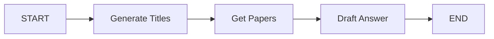

# Research Paper Summarizer 📚

A LangGraph-powered application that automatically finds and summarizes relevant research papers for any given topic using the Semantic Scholar API.

## 🎯 Overview

This project demonstrates a complete LangGraph workflow that:
1. **Generates paper titles** based on user input using LLM
2. **Fetches research papers** from Semantic Scholar API
3. **Summarizes papers** with key insights and information
4. **Provides a Streamlit interface** for easy interaction

## ✨ Features

- **Sequential Learning Path**: Papers are selected to provide a logical learning progression
- **Real-time Paper Search**: Uses Semantic Scholar API for up-to-date research papers
- **Intelligent Summarization**: LLM-powered summaries of abstracts and key information
- **Interactive Web Interface**: User-friendly Streamlit application
- **Customizable Search**: Choose number of papers to fetch (1-10)

## 🏗️ LangGraph Workflow



### Workflow Steps:

1. **Generate Titles Node**: 
   - Takes user topic and generates relevant paper titles
   - Creates sequential learning path
   
2. **Get Papers Node**:
   - Searches Semantic Scholar API for each generated title
   - Fetches title, abstract, URL, and citation count
   
3. **Draft Answer Node**:
   - Combines all paper information
   - Creates comprehensive summary using LLM

## 🚀 Getting Started

### Prerequisites

- Python 3.8+
- Hugging Face API access
- Internet connection (for Semantic Scholar API)

### Installation

1. **Clone the repository**
   ```bash
   git clone https://github.com/swarupd07/LangGraphProjects.git
   cd "LangGraphProjects/P1: Research Paper Summarizer"
   ```

2. **Install dependencies**
   ```bash
   pip install -r requirements.txt
   ```

3. **Set up environment variables**
   ```bash
   # Create .env file
   "HUGGINGFACEHUB_API_TOKEN=your_token_here"
   ```

### Running the Application

1. **Start the Streamlit app**
   ```bash
   streamlit run main.py
   ```

2. **Open your browser** to `http://localhost:8501`

3. **Enter a search topic** (e.g., "Linear Regression", "Transformer Architecture")

4. **Select number of papers** to fetch (1-10)

5. **Click "Get Papers"** and wait for results

## 📊 Example Usage

### Input:
- **Topic**: "Linear Regression"
- **Papers**: 3

### Expected Output:
The system will generate sequential paper titles like:
1. Foundational linear regression paper
2. Improved methods or variations
3. Modern applications or extensions

Each paper summary includes:
- **Title**: Original paper title
- **Abstract Summary**: Key points and findings
- **Citations**: Number of times cited
- **URL**: Direct link to paper

## 🔧 Configuration

### LLM Settings
```python
# Current model: OpenAI GPT-OSS-20B via Hugging Face
llm = HuggingFaceEndpoint(
    endpoint_url="openai/gpt-oss-20b",
    task="text-generation",
)
```

### API Limitations
- **Semantic Scholar**: Rate limits apply (check their documentation)
- **Hugging Face**: API token required for model access

## 📁 Project Structure

```
research-paper-summarizer/
├── .env.example                 # Environment variables template
├── Get_Research_Papers.ipynb    # LangGraph implementation ( Jupyter Notebook)            
├── Get_Research_Papers.py       # Streamlit app and LangGraph implementation
├── README.md                    # This file
└── requirements.txt             # Project dependencies
```

## 🛠️ Technical Details

### State Management
The `PaperInfo` TypedDict manages workflow state:
- `prompt`: User input and LLM prompt
- `topic`: Generated paper titles list
- `top_search`: Number of papers to fetch
- `title`, `abstract`, `url`, `citationCount`: Paper data lists
- `result`: Final summarized output


## 🚧 Known Issues & Limitations

1. **API Dependency**: Requires internet connection for Semantic Scholar
2. **Rate Limits**: May hit API limits with frequent usage
3. **LLM Variability**: Generated titles may not always match available papers
4. **Abstract Quality**: Some papers may have incomplete abstracts


## 📚 Learning Outcomes

This project demonstrates:
- **LangGraph state management** and workflow design
- **API integration** with external services
- **LLM prompt engineering** for specific tasks
- **Streamlit app development** for AI applications

## 🐛 Troubleshooting

### Common Issues:

**"API token not found"**
- Ensure `.env` file contains valid Hugging Face token
- Check token permissions

**"No papers found"**
- Try broader search terms
- Check internet connection
- Verify Semantic Scholar API is accessible

**"Streamlit not starting"**
- Ensure all dependencies are installed
- Check Python version compatibility
- Try `pip install --upgrade streamlit`

## 📝 License

This project is part of the LangGraph Mini Projects collection and follows the same MIT License.

---

⭐ **Star the main repository** if this project helped you learn LangGraph!
