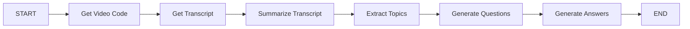

# YouTube Video Summarizer & Q&A Generator 🎥

A comprehensive LangGraph-powered application that automatically extracts, summarizes, and generates Q&A from YouTube videos or direct transcript input.

## 🎯 Overview

This project showcases an advanced LangGraph workflow that:
1. **Extracts video code** from YouTube URLs
2. **Fetches transcripts** using YouTube Transcript API
3. **Summarizes content** topic-wise using LLM
4. **Extracts key topics** from the summary
5. **Generates questions** based on topics (optional)
6. **Provides answers** to generated questions (optional)

## ✨ Features

- **Dual Input Support**: Accept YouTube URLs or direct transcript input
- **Topic-wise Summarization**: Organizes content by key themes
- **Smart Q&A Generation**: Creates relevant questions and detailed answers
- **Error Handling**: Graceful handling of invalid URLs or unavailable transcripts
- **Interactive Interface**: User-friendly Streamlit application
- **Flexible Output**: Choose between summary only, questions, or full Q&A

## 🏗️ LangGraph Workflow



### Workflow Steps:

1. **Get Video Code Node**: 
   - Extracts video ID from YouTube URL
   - Handles both youtube.com and youtu.be formats
   - Skips if transcript provided directly
   
2. **Get Transcript Node**:
   - Uses YouTube Transcript API to fetch video transcript
   - Handles errors for unavailable transcripts
   - Uses direct input if provided
   
3. **Summarize Transcript Node**:
   - Creates topic-wise summary using LLM
   - Organizes content by key themes
   
4. **Extract Topics Node**:
   - Identifies key topics from summary
   - Creates structured list of main themes
   
5. **Generate Questions Node** (Optional):
   - Creates relevant questions based on topics
   - Only runs if user enables questions
   
6. **Generate Answers Node** (Optional):
   - Provides detailed answers using original transcript
   - Only runs if both questions and answers are enabled

## 🚀 Getting Started

### Prerequisites

- Python 3.8+
- Hugging Face API access
- Internet connection (for YouTube API)

### Installation

1. **Clone the repository**
   ```bash
   git clone https://github.com/swarupd07/LangGraphProjects.git
   cd "LangGraphProjects/P2: YouTube Video Summarizer"
   ```

2. **Install dependencies**
   ```bash
   pip install -r requirements.txt
   ```

3. **Set up environment variables**
   ```bash
   # Create .env file
   echo "HUGGINGFACEHUB_API_TOKEN=your_token_here" > .env
   ```

### Running the Application

1. **Start the Streamlit app**
   ```bash
   streamlit run main.py
   ```

2. **Open your browser** to `http://localhost:8501`

3. **Choose input method**:
   - Enter YouTube URL, OR
   - Paste transcript directly

4. **Configure options**:
   - ✅ Generate Questions (optional)
   - ✅ Generate Answers (optional, requires questions)

5. **Click "Result"** and wait for processing

## 📊 Example Usage

### Input Options:

**Option 1: YouTube URL**
```
https://www.youtube.com/watch?v=dQw4w9WgXcQ
https://youtu.be/dQw4w9WgXcQ
```

**Option 2: Direct Transcript**
```
Welcome to this tutorial on machine learning...
[Paste your transcript here]
```

### Expected Output:

#### 📋 Topic-wise Summary
```
Topic 1: Introduction to Machine Learning
- Definition and core concepts
- Historical context and evolution

Topic 2: Types of Machine Learning
- Supervised learning approaches
- Unsupervised learning methods
- Reinforcement learning basics
```

#### ❓ Generated Questions (if enabled)
```
1. What is the definition of machine learning?
2. How does supervised learning differ from unsupervised learning?
3. What are the key applications of reinforcement learning?
```

#### 💡 Generated Answers (if enabled)
```
Question: What is the definition of machine learning?
Answer: Machine learning is a subset of artificial intelligence that enables computers to learn and improve from experience without being explicitly programmed...
```

## 🔧 Configuration

### LLM Settings
```python
# Current model: OpenAI GPT-OSS-20B via Hugging Face
llm = HuggingFaceEndpoint(
    endpoint_url="openai/gpt-oss-20b",
    task="text-generation",
)
```

### Supported URL Formats
- `https://www.youtube.com/watch?v=VIDEO_ID`
- `https://youtu.be/VIDEO_ID`
- `https://www.youtube.com/watch?v=VIDEO_ID&t=123s`

## 📁 Project Structure

```
youtube-video-summarizer/
├── main.py                 # Streamlit app and LangGraph implementation
├── requirements.txt        # Project dependencies
├── README.md              # This file
├── .env.example           # Environment variables template
└── examples/              # Example outputs and usage
```

## 🛠️ Technical Details

### State Management
The `VideoInfo` TypedDict manages workflow state:
- `input_transcript`: Direct transcript input
- `video_url`: YouTube video URL
- `want_questions`, `want_answers`: User preferences
- `video_code`: Extracted video ID
- `transcript`: Video transcript text
- `summary`: Topic-wise summary
- `topic`: List of key topics
- `questions`: Generated questions
- `qa`: Questions and answers
- `Error`: Error messages

### Error Handling
- **Invalid URLs**: Detects malformed YouTube URLs
- **Unavailable Transcripts**: Handles videos without captions
- **API Failures**: Graceful degradation with error messages
- **Empty Inputs**: Validates user input requirements

### URL Processing
```python
# Handles multiple YouTube URL formats
if "v=" in url:
    video_id = url.split("v=")[1].split("&")[0]
elif "youtu.be/" in url:
    video_id = url.split("youtu.be/")[1].split("?")[0]
```

## 🚧 Known Issues & Limitations

1. **Transcript Availability**: Not all YouTube videos have transcripts
2. **Language Support**: Primarily works with English transcripts
3. **Video Length**: Very long videos may hit LLM token limits
4. **API Rate Limits**: YouTube Transcript API has usage limits
5. **Private Videos**: Cannot access private or restricted content


## 🎓 Educational Use Cases

- **Students**: Quickly review lecture content and test understanding
- **Researchers**: Extract key points from conference talks
- **Professionals**: Summarize training videos and webinars
- **Content Creators**: Generate study guides from educational content
- **Language Learners**: Practice with Q&A from native content

## 📚 Learning Outcomes

This project demonstrates:
- **Complex LangGraph Workflows**: Multi-step conditional processing
- **External API Integration**: YouTube Transcript API usage
- **Error Handling Patterns**: Robust error management in workflows
- **State Management**: Complex state transitions and data flow
- **User Experience Design**: Flexible input options and clear output
- **LLM Prompt Engineering**: Specialized prompts for different tasks

## 🐛 Troubleshooting

### Common Issues:

**"Could not retrieve transcript"**
- Video may not have captions/subtitles
- Video might be private or restricted
- Try using direct transcript input instead

**"Invalid YouTube URL"**
- Ensure URL is from YouTube (youtube.com or youtu.be)
- Check URL format is correct
- Try copying URL directly from browser

**"API token not found"**
- Ensure `.env` file contains valid Hugging Face token
- Check token has appropriate permissions

**"No output generated"**
- Check if transcript is too short
- Verify LLM model is accessible
- Try with different content

### Performance Tips:

- **Shorter Videos**: Work better due to token limits
- **Clear Audio**: Better transcript quality
- **Educational Content**: Gets better summaries than entertainment
- **English Content**: Currently works best with English


## 📝 License

This project is part of the LangGraph Mini Projects collection and follows the same MIT License.

---

⭐ **Star the main repository** if this project helped you learn LangGraph workflows!

🐛 **Found an issue?** [Report it here](https://github.com/swarupd07/LangGraphProjects/issues)

💡 **Have ideas for improvement?** Contributions welcome!
