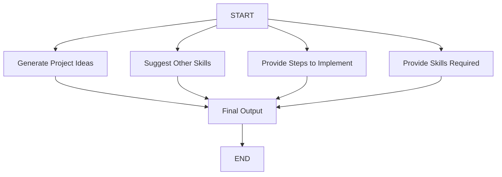

# Project Idea Generator 💡

An intelligent LangGraph-powered application that generates personalized project ideas or provides implementation guidance for existing project concepts. Features dual modes, structured output, and parallel processing for comprehensive project planning.

## 🎯 Overview

This project showcases an advanced LangGraph workflow with **parallel execution** that:

### Mode 1: Generate New Project Ideas
1. **Generates project ideas** based on domain, skills, and complexity
2. **Suggests additional skills** to expand your capabilities
3. **Creates structured output** using Pydantic schemas
4. **Provides encouraging guidance** with personalized recommendations

### Mode 2: Implementation Help for Existing Ideas
1. **Analyzes existing project ideas** for refinement
2. **Provides step-by-step implementation** plans
3. **Identifies required skills** for project completion
4. **Creates actionable roadmaps** for project success

## ✨ Features

- **Dual Mode Interface**: Generate new ideas OR get help with existing ones
- **Parallel Processing**: Multiple nodes execute simultaneously for efficiency
- **Structured Output**: Uses Pydantic for consistent, validated responses
- **Skill Assessment**: Analyzes current skills and suggests improvements
- **Complexity Scaling**: Adjusts recommendations based on experience level
- **Interactive UI**: Modern Streamlit interface with sidebar navigation
- **Personalized Results**: Tailored recommendations based on user input

## 🏗️ LangGraph Workflow



### Parallel Processing Architecture:

**Layer 1**: Parallel execution of four nodes from START
- All four processing nodes run simultaneously
- Efficient resource utilization
- Faster response times

**Layer 2**: Convergence at Final Output node
- Combines results from all parallel processes
- Creates cohesive, formatted response

### Workflow Details:

1. **Generate Project Ideas Node** (Mode 1):
   - Uses structured Pydantic output parser
   - Generates multiple project ideas with descriptions
   - Skipped if user provides existing idea

2. **Suggest Other Skills Node** (Mode 1):
   - Recommends complementary skills for the domain
   - Based on current skills and complexity level
   - Helps users expand their capabilities

3. **Provide Steps to Implement Node** (Mode 2):
   - Refines user's existing project idea
   - Creates detailed implementation roadmap
   - Breaks down complex projects into manageable steps

4. **Provide Skills Required Node** (Mode 2):
   - Analyzes project requirements
   - Identifies necessary technical skills
   - Helps users assess readiness

5. **Final Output Node**:
   - Combines all processed information
   - Creates user-friendly, formatted response
   - Includes encouragement and actionable guidance

## 🚀 Getting Started

### Prerequisites

- Python 3.8+
- Hugging Face API access
- Internet connection for model access

### Installation

1. **Clone the repository**
   ```bash
   git clone https://github.com/swarupd07/LangGraphProjects.git
   cd "LangGraphProjects/P3: Project Idea Generator"
   ```

2. **Install dependencies**
   ```bash
   pip install -r requirements.txt
   ```

3. **Set up environment variables**
   ```bash
   # Create .env file
   echo "HUGGINGFACEHUB_API_TOKEN=your_token_here" > .env
   ```

### Running the Application

1. **Start the Streamlit app**
   ```bash
   streamlit run main.py
   ```

2. **Open your browser** to `http://localhost:XXXX`

3. **Choose your mode** from the sidebar:
   - **Generate New Project Ideas**
   - **Get Help with Existing Idea**

4. **Follow the interface** for your selected mode

## 📊 Usage Examples

### Mode 1: Generate New Project Ideas

**Input:**
```
Project Domain: Data Science
Skills: Python, Pandas, Matplotlib
Complexity Level: Intermediate
Number of Ideas: 3
```

**Expected Output:**
```
🎉 Great choice focusing on Data Science! With your Python and visualization skills, you're ready for some exciting intermediate projects.

Project Ideas:

1. **Customer Segmentation Dashboard**
   Build an interactive dashboard that segments customers based on purchasing behavior using clustering algorithms.

2. **Stock Price Prediction Tool**
   Create a web application that predicts stock prices using machine learning models and real-time data.

3. **Social Media Sentiment Analyzer**
   Develop a tool that analyzes sentiment from social media posts and visualizes trends over time.

Other Skills to Learn:
- Scikit-learn
- Streamlit/Dash
- SQL
- Web scraping
- API integration
```

### Mode 2: Implementation Help

**Input:**
```
"I want to build a mobile app that helps people track their fitness goals with personalized workout recommendations"
```

**Expected Output:**
```
🚀 Excellent project idea! Building a personalized fitness app is a great way to combine mobile development with AI recommendations.

Project Title: FitTrack Pro - Personalized Fitness Companion

Skills Required:
- Mobile development (React Native/Flutter or Native iOS/Android)
- Backend development (Node.js, Python, or similar)
- Database management (Firebase, PostgreSQL)
- Machine Learning (for recommendations)
- API integration
- UI/UX design principles

Steps to Follow:

1. Plan and Design
   - Define user personas and core features
   - Create wireframes and user flow diagrams
   - Design the app interface and user experience

2. Backend Development
   - Set up database schema for users, workouts, progress
   - Implement user authentication and profile management
   - Create APIs for workout data and recommendations

3. Recommendation Engine
   - Implement basic recommendation algorithms
   - Collect user preferences and fitness data
   - Train models for personalized workout suggestions

4. Mobile App Development
   - Build core app screens (profile, workouts, progress)
   - Implement workout tracking functionality
   - Connect frontend with backend APIs

5. Testing and Deployment
   - Conduct thorough testing on multiple devices
   - Deploy backend to cloud platform
   - Publish app to app stores
```

## 🔧 Technical Architecture

### Structured Output with Pydantic

```python
class ProjectIdeaSchema(BaseModel):
    project_idea: List[str] = Field(description="List of project ideas")
    project_description: List[str] = Field(description="Corresponding descriptions")
```

### State Management

```python
class ProjectInfo(TypedDict):
    # Input Variables (Mode Selection)
    project_domain: str
    skills: str
    input_idea: str
    
    # Processing Variables
    project_idea: List[str]
    project_description: List[str]
    other_skills_to_learn: str
    steps_to_implement: str
    skills_required: str
    
    # Final Output
    output: str
```

### Parallel Execution Strategy

- **Efficiency**: All processing nodes start simultaneously
- **Resource Optimization**: Maximizes LLM utilization
- **Scalability**: Easy to add new processing nodes
- **Maintainability**: Clear separation of concerns

## 📁 Project Structure

```
project-idea-generator/
├── Project_Idea_Generator.py    # Streamlit app and LangGraph implementation
├── requirements.txt             # Project dependencies
├── README.md                    # This file
├── .env.example                 # Environment variables template
└── examples/                    # Example outputs and usage scenarios
```

## 🛠️ Advanced Features

### Intelligent Mode Detection
- Automatically processes based on input type
- Seamless switching between generation and implementation modes
- Context-aware responses

### Complexity-Aware Recommendations
- **Beginner**: Simple, foundational projects
- **Intermediate**: Multi-component applications
- **Advanced**: System design and architecture challenges

### Skill Gap Analysis
- Identifies missing skills for project domains
- Provides learning roadmaps
- Suggests complementary technologies

## 🎯 Use Cases

### For Students
- **Course Projects**: Generate ideas aligned with curriculum
- **Portfolio Building**: Create diverse project portfolios
- **Skill Development**: Learn what skills to focus on next

### For Developers
- **Side Projects**: Find inspiration for personal projects
- **Career Transition**: Bridge skills for new domains
- **Learning Paths**: Structured approach to skill building

### For Bootcamp Graduates
- **Job Preparation**: Build portfolio projects
- **Interview Projects**: Practice explaining project implementation
- **Skill Assessment**: Understand market requirements

### For Career Switchers
- **Domain Exploration**: Understand project requirements in new fields
- **Skill Planning**: Create learning roadmaps
- **Project Validation**: Get feedback on project ideas

## 🚧 Known Limitations

1. **Domain Dependency**: Works best with well-defined technical domains
2. **Skill Interpretation**: May misunderstand vague skill descriptions
3. **Implementation Depth**: Steps are high-level, may need detailed breakdown
4. **Technology Bias**: Recommendations may favor popular technologies
5. **Market Relevance**: Ideas may not reflect current market needs

## 🔄 Future Enhancements

- [ ] **Technology Trend Integration**: Include latest tech trends in recommendations
- [ ] **Project Difficulty Scoring**: Rate projects by time/complexity
- [ ] **Resource Links**: Provide learning resources for suggested skills
- [ ] **Community Features**: User sharing and rating of project ideas
- [ ] **Progress Tracking**: Track project implementation progress

## 🎓 Learning Outcomes

This project demonstrates:

### LangGraph Patterns
- **Parallel Node Execution**: Efficient workflow design
- **Conditional Processing**: Mode-based execution paths
- **State Convergence**: Combining multiple processing results

### Advanced LangChain Features
- **Structured Output Parsing**: Pydantic integration
- **Prompt Templates**: Reusable prompt patterns
- **Chain Composition**: Complex processing pipelines

### Application Architecture
- **Mode-Based UI Design**: Context-sensitive interfaces
- **State Management**: Complex application state handling
- **User Experience**: Intuitive workflow design

### Performance Tips
- **Clear Descriptions**: Provide detailed, specific input
- **Common Domains**: Popular fields get better results
- **Realistic Complexity**: Match your actual skill level
- **Specific Skills**: List concrete technologies, not general concepts

## 📈 Success Metrics

Track your success with generated projects:
- **Implementation Rate**: How many ideas you actually build
- **Skill Acquisition**: New skills learned from recommendations
- **Project Completion**: Successfully finished projects
- **Career Impact**: Projects that enhanced your career

## 📝 License

This project is part of the LangGraph Mini Projects collection and follows the same MIT License.

---

⭐ **Star the repository** if this project sparked your next great idea!

🚀 **Built something amazing?** Share it in the discussions!

💡 **Have a feature request?** [Open an issue](https://github.com/swarupd07/LangGraphProjects/issues)

🤝 **Want to contribute?** We'd love your help expanding project domains!
