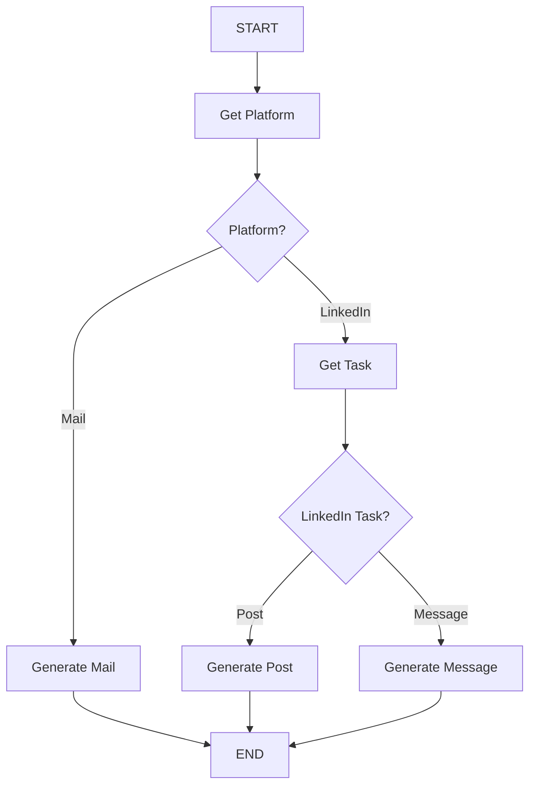

# Professional Writing Assistant ✍️

An intelligent LangGraph-powered application that generates professional emails, LinkedIn posts, and LinkedIn messages using conditional workflows and structured output parsing.

## 🎯 Overview

This project demonstrates advanced LangGraph patterns with **conditional routing** that:

1. **Identifies platform** (Email or LinkedIn) from user input
2. **Determines LinkedIn task type** (Post or Message) if applicable
3. **Generates appropriate content** based on platform and task
4. **Provides professional, context-aware writing** for business communication

## ✨ Features

- **Smart Platform Detection**: Automatically identifies whether user wants email or LinkedIn content
- **LinkedIn Task Classification**: Distinguishes between posts and messages
- **Conditional Workflows**: Dynamic routing based on user intent
- **Professional Tone**: Generates business-appropriate content
- **Structured Output**: Uses Pydantic schemas for reliable parsing
- **Clean Interface**: Intuitive Streamlit UI with helpful tips
- **Context-Aware**: Understands purpose and adjusts tone accordingly

## 🏗️ LangGraph Workflow



### Conditional Routing Architecture:

**First Decision Point**: Platform Classification
- **Email Path**: Direct to email generation
- **LinkedIn Path**: Proceeds to task classification

**Second Decision Point**: LinkedIn Task Type
- **Post Path**: Generates public LinkedIn post
- **Message Path**: Creates private LinkedIn message

### Workflow Details:

1. **Get Platform Node**:
   - Uses structured output to identify platform
   - Literal type validation: "Mail" or "LinkedIn"
   - Routes to appropriate processing branch

2. **Generate Mail Node** (Email Path):
   - Creates professional email drafts
   - Understands business context and purpose
   - Maintains appropriate formal tone

3. **Get Task Node** (LinkedIn Branch):
   - Classifies LinkedIn content type
   - Literal validation: "Post" or "Message"
   - Routes to specific LinkedIn generators

4. **Generate Post Node**:
   - Creates professional LinkedIn posts
   - Suitable for public sharing
   - Engaging and professional tone

5. **Generate Message Node**:
   - Crafts personal LinkedIn messages
   - Connection requests, networking, mentorship
   - Professional yet personal approach

## 🚀 Getting Started

### Prerequisites

- Python 3.8+
- Hugging Face API access
- Internet connection for model access

### Installation

1. **Clone the repository**
   ```bash
   git clone https://github.com/swarupd07/LangGraphProjects.git
   cd "LangGraphProjects/P4: Professional Writing Assistant"
   ```

2. **Install dependencies**
   ```bash
   pip install -r requirements.txt
   ```

3. **Set up environment variables**
   ```bash
   # Create .env file
   echo "HUGGINGFACEHUB_API_TOKEN=your_token_here" > .env
   ```

### Running the Application

1. **Start the Streamlit app**
   ```bash
   streamlit run Professional_Writing_Assistant.py
   ```

2. **Open your browser** to `http://localhost:XXXX`

3. **Describe your writing request** in the text area

4. **Click "Generate Content"** and get your professional content

## 📊 Usage Examples

### Email Generation

**Input:**
```
I want to write a professional email to HR requesting vacation leave for next week due to a family emergency
```

**Generated Output:**
```
Subject: Vacation Leave Request - [Your Name]

Dear HR Team,

I hope this email finds you well. I am writing to formally request vacation leave from [start date] to [end date] next week due to an unexpected family emergency that requires my immediate attention.

I understand this is short notice, and I apologize for any inconvenience this may cause. I am committed to ensuring a smooth transition of my responsibilities during my absence. I will coordinate with my team members to cover urgent tasks and will be available via email for any critical matters.

I would be happy to discuss this request further and provide any additional documentation if needed. Thank you for your understanding and consideration.

Best regards,
[Your Name]
```

### LinkedIn Post

**Input:**
```
I want to write a LinkedIn post about completing my machine learning certification and thanking my mentors
```

**Generated Output:**
```
🎉 Excited to share that I've successfully completed my Machine Learning certification! 

This journey has been incredibly rewarding, filled with late-night coding sessions, complex algorithms, and countless "aha!" moments. From understanding linear regression to diving deep into neural networks, every step has been a learning experience.

I want to extend my heartfelt gratitude to my mentors who guided me through this journey. Their insights, patience, and encouragement made all the difference. Special thanks to [Mentor Names] for their invaluable support.

Looking forward to applying these skills in real-world projects and continuing to grow in the field of AI/ML. The learning never stops! 💡

#MachineLearning #Certification #AI #DataScience #ProfessionalDevelopment #Gratitude
```

### LinkedIn Message

**Input:**
```
I want to send a message to a senior data scientist at Google asking for career advice and mentorship
```

**Generated Output:**
```
Hi [Name],

I hope this message finds you well. I came across your profile and was impressed by your extensive experience in data science at Google, particularly your work in [specific area/project if known].

I'm currently [your current role/situation] and am passionate about advancing my career in data science. Your journey from [previous role] to your current position at Google is truly inspiring and aligns with my career aspirations.

I would greatly appreciate the opportunity to learn from your experience. Would you be open to a brief 15-20 minute conversation about your career path and any advice you might have for someone looking to break into/advance in data science at top tech companies?

I understand you must be incredibly busy, so I'm flexible with timing and would be grateful for even a few minutes of your insights.

Thank you for considering my request.

Best regards,
[Your Name]
```

## 🔧 Technical Architecture

### Structured Output Schemas

```python
class taskschema(BaseModel):
    platform: Literal["Mail", "LinkedIn"] = Field(
        description='Where will task get execute? Mail or LinkedIn'
    )

class linkedIntaskschema(BaseModel):
    task: Literal["Post", "Message"] = Field(
        description='What is the task user want to perform? a Message or Post'
    )
```

### Conditional Logic Functions

```python
def which_platform(State: AssistantState) -> Literal["Generate_mail", "get_task"]:
    if State['platform'] == "Mail":
        return "Generate_mail"
    else:
        return "get_task"

def which_task(State: AssistantState) -> Literal["Generate_post", "Generate_message"]:
    if State['LinkedIn_task'] == "Post":
        return "Generate_post"
    else:
        return "Generate_message"
```

### State Management

```python
class AssistantState(TypedDict):
    user_input: str
    platform: Literal["Mail", "LinkedIn"]
    email: str
    LinkedIn_task: Literal["Post", "Message"]
    LinkedIn_content: str
```

## 📁 Project Structure

```
professional-writing-assistant/
├── main.py                    # Streamlit app and LangGraph implementation
├── requirements.txt           # Project dependencies
├── README.md                 # This file
├── .env.example              # Environment variables template
└── examples/                 # Sample outputs
```

## 🎯 Use Cases

### For Professionals
- **Email Communication**: Meeting requests, follow-ups, announcements
- **LinkedIn Networking**: Connection requests, industry updates
- **Career Development**: Mentorship requests, job applications

### For Job Seekers
- **Application Emails**: Cover letter content, follow-up emails
- **LinkedIn Presence**: Professional posts, networking messages
- **Interview Follow-ups**: Thank you messages, additional information

### For Students
- **Academic Emails**: Professor communication, internship applications
- **Professional Development**: Industry connection requests
- **Career Transition**: LinkedIn content for career changes

### for Entrepreneurs
- **Business Communication**: Client emails, partnership requests
- **LinkedIn Marketing**: Company updates, thought leadership
- **Networking**: Investor outreach, mentor connections

## 🛠️ Advanced Features

### Intelligent Context Understanding
- **Purpose Detection**: Identifies the main objective of communication
- **Tone Adjustment**: Adapts formality based on context
- **Audience Awareness**: Considers recipient relationship

### Platform-Specific Optimization
- **Email Structure**: Subject lines, professional formatting
- **LinkedIn Posts**: Hashtag suggestions, engagement optimization
- **LinkedIn Messages**: Character limits, networking etiquette

### Content Quality Assurance
- **Professional Tone**: Maintains business-appropriate language
- **Clarity**: Ensures clear and concise communication
- **Completeness**: Includes all necessary information

## 🚧 Known Limitations

1. **Language Support**: Primarily optimized for English content
2. **Cultural Context**: May not account for regional communication styles
3. **Industry Specifics**: Generic approach may not suit specialized fields
4. **Personal Voice**: Generated content may lack individual personality
5. **Context Limitations**: May miss subtle nuances in complex requests

## 🔄 Future Enhancements

- [ ] **Template Library**: Pre-built templates for common scenarios
- [ ] **Tone Customization**: User-selectable tone options (formal, casual, friendly)
- [ ] **Industry-Specific Content**: Tailored content for different industries
- [ ] **Multi-language Support**: Content generation in multiple languages
- [ ] **Email Threading**: Responses to existing email conversations
- [ ] **Content Calendar**: Schedule and plan content across platforms
- [ ] **A/B Testing**: Generate multiple versions for comparison

## 🎓 Learning Outcomes

This project demonstrates:

### LangGraph Advanced Patterns
- **Conditional Edges**: Dynamic routing based on classification
- **Multi-path Workflows**: Different processing paths for different content types
- **State-based Decisions**: Using state values for routing logic

### Structured Output Processing
- **Literal Type Validation**: Ensuring consistent classification
- **Pydantic Integration**: Reliable data parsing and validation
- **Chain Composition**: Complex processing pipelines

### Professional Application Design
- **User Experience**: Intuitive interface for business users
- **Error Handling**: Graceful failure management
- **Content Quality**: Professional-grade output generation


### Contribution Ideas
- Add new platforms (Twitter, Instagram, etc.)
- Implement industry-specific templates
- Add tone customization options
- Improve context understanding algorithms

## 🐛 Troubleshooting

### Common Issues

**"Platform not detected correctly"**
- Make your request more specific about the platform
- Include keywords like "email", "LinkedIn post", or "LinkedIn message"
- Try rephrasing with clearer intent

**"Generated content too generic"**
- Provide more context about your specific situation
- Include details about audience, purpose, and desired tone
- Mention specific points you want to cover

**"Tone not appropriate"**
- Specify the desired level of formality
- Mention the relationship with your audience
- Include context about the communication purpose

### Quality Tips
- **Be Specific**: Provide clear context and purpose
- **Include Details**: Mention key points to cover
- **Specify Audience**: Describe your target recipient
- **State Intent**: Clearly express your communication goal

## 📝 License

This project is part of the LangGraph Mini Projects collection and follows the same MIT License.

---

⭐ **Star the repository** if this assistant helped improve your professional communication!

📝 **Used it for important communications?** Share your success stories!

💼 **Want more features?** [Open an issue](https://github.com/swarupd07/LangGraphProjects/issues) with your suggestions!

🤝 **Contribute templates** for specific industries or use cases!
