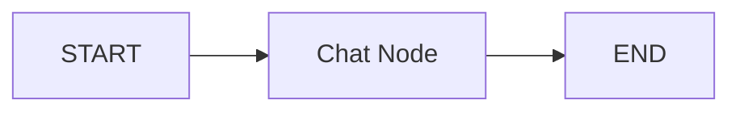

# Basic Chatbot with Memory 🤖

A foundational LangGraph-powered chatbot that demonstrates conversation memory management using LangChain message handling and Streamlit session state.

## 🎯 Overview

This project showcases fundamental LangGraph patterns with **message memory** that:

1. **Maintains conversation history** using LangGraph message annotations
2. **Handles message types** with proper BaseMessage formatting
3. **Manages session state** for persistent conversations
4. **Provides simple chat interface** with memory across interactions
5. **Demonstrates core concepts** for building stateful conversational AI

## ✨ Features

- **Persistent Memory**: Maintains conversation context across messages
- **Message Type Handling**: Proper HumanMessage and AIMessage formatting
- **Session Management**: Streamlit session state for conversation persistence
- **Simple Architecture**: Clean, minimal LangGraph implementation
- **Interactive Interface**: Real-time chat with conversation history
- **Clear Conversation**: Reset functionality for new conversations
- **Message Annotations**: Uses `add_messages` for proper state management

## 🏗️ LangGraph Workflow



### Simple Linear Architecture:

**Single Node Design**:
- Processes all conversation logic in one node
- Handles message history automatically
- Returns response to complete the cycle

**Message Flow**:
- User input → HumanMessage → LLM → AIMessage → Display
- All messages stored in annotated state list
- Conversation context maintained automatically

### Workflow Details:

1. **Chat Node**:
   - Receives current message state
   - Processes conversation with full context
   - Returns AI response as AIMessage
   - Leverages `add_messages` annotation for state management

## 🔧 Technical Architecture

### Message State Management

```python
class ChatState(TypedDict):
    messages: Annotated[list[BaseMessage], add_messages]
```

**Key Components**:
- **Annotated List**: Automatic message accumulation
- **BaseMessage Types**: Proper message formatting
- **add_messages**: LangGraph built-in message handler

### Session State Integration

```python
# Streamlit session state for UI persistence
if "conversation" not in st.session_state:
    st.session_state.conversation = []
    st.session_state.messages = []
```

### Message Type Conversion

```python
# Convert UI messages to LangChain format
if msg["role"] == "You":
    st.session_state.messages.append(HumanMessage(content=msg["content"]))
elif msg["role"] == "AI":
    st.session_state.messages.append(AIMessage(content=msg["content"]))
```

## 🚀 Getting Started

### Prerequisites

- Python 3.8+
- Hugging Face API access
- Internet connection for model access

## 📁 Project Structure

```
basic-chatbot-with-memory/
├── main.py                    # Streamlit app and LangGraph implementation  
├── requirements.txt           # Project dependencies
├── README.md                 # This file
├── Example
└── .env.example              # Environment variables template
```

## 🎓 Educational Value

### LangGraph Fundamentals

This project teaches essential LangGraph concepts:

1. **State Management**: Using TypedDict for state definition
2. **Message Annotations**: Leveraging `add_messages` for automatic accumulation
3. **Node Functions**: Basic node implementation patterns
4. **Graph Construction**: Simple linear workflow design

### Message Handling Patterns

```python
# Proper message type usage
HumanMessage(content="User input")  # For user messages
AIMessage(content="AI response")    # For AI responses
```

### Memory Implementation

- **Automatic Accumulation**: `add_messages` handles message history
- **Type Safety**: BaseMessage ensures proper message formatting
- **State Persistence**: Conversation context maintained across turns

## 🔍 Key Learning Concepts

### 1. LangGraph Message System
- Understanding BaseMessage hierarchy
- Proper message type selection
- Automatic state accumulation

### 2. Conversation Memory
- Context preservation across turns
- Message history management
- State-based conversation flow

### 3. UI Integration
- Streamlit session state management
- Real-time conversation display
- User experience considerations

### 4. Basic Graph Architecture
- Single-node processing
- Linear workflow design
- Simple state transitions

## 🛠️ Customization Options

### Model Configuration
```python
llm = HuggingFaceEndpoint(
    endpoint_url="openai/gpt-oss-20b",  # Change model here
    task="text-generation",
)
```

### Memory Limitations
```python
# Add message count limiting
def chat_node(state: ChatState):
    messages = state['messages']
    # Keep only last N messages for memory management
    if len(messages) > 10:
        messages = messages[-10:]
    # ... rest of function
```

### Custom Message Types
```python
from langchain_core.messages import SystemMessage

# Add system message for context
def add_system_context(state: ChatState):
    system_msg = SystemMessage(content="You are a helpful assistant.")
    return {'messages': [system_msg]}
```

## 🚧 Known Limitations

1. **Memory Growth**: Unlimited message history may cause performance issues
2. **No Persistence**: Conversations lost when browser refreshed
3. **Single User**: No multi-user conversation support
4. **Basic Error Handling**: Limited error recovery mechanisms
5. **No Message Editing**: Cannot modify or delete previous messages

## 🔄 Enhancement Ideas

### Immediate Improvements
- [ ] **Message Limits**: Implement conversation length limits
- [ ] **Conversation Persistence**: Save/load conversations
- [ ] **Export Functionality**: Download conversation history
- [ ] **Message Timestamps**: Add time tracking to messages

### Advanced Features
- [ ] **Multiple Conversations**: Support multiple chat sessions
- [ ] **User Profiles**: Personalized conversation contexts
- [ ] **Message Search**: Find specific messages in history
- [ ] **Conversation Summarization**: Compress long conversations
- [ ] **Response Streaming**: Real-time response generation

## 🎯 Use Cases

### Learning and Education
- **LangGraph Introduction**: First project for understanding basics
- **Conversation AI Concepts**: Understanding memory and state
- **Streamlit Integration**: Learning UI development with AI

### Development Foundation  
- **Chatbot Prototyping**: Quick conversation AI testing
- **Memory Pattern Testing**: Experimenting with conversation flow
- **UI Development**: Building chat interfaces

### Personal Projects
- **AI Assistant**: Basic personal AI helper
- **Learning Companion**: Study buddy with memory
- **Conversation Practice**: Language or topic practice tool

## 🤝 Contributing

This is a foundational project perfect for newcomers to contribute to:

1. **Fork** the repository
2. **Create** a feature branch for enhancements
3. **Test** conversation flows thoroughly  
4. **Keep simplicity** as the core principle
5. **Submit** a pull request

### Beginner-Friendly Contributions
- Add conversation export functionality
- Improve error handling and user feedback
- Add message character/word counts
- Create conversation templates or starters

## 🐛 Troubleshooting

### Common Issues

**"Messages not persisting"**
- Check Streamlit session state initialization
- Ensure proper message type conversion
- Verify `add_messages` annotation usage

**"Conversation not displaying"**  
- Check message role formatting in session state
- Ensure proper Streamlit chat_message usage
- Verify conversation history structure

**"AI responses generic"**
- Provide more conversation context
- Check if message history is being sent to model
- Ensure proper BaseMessage formatting

### Performance Tips
- **Clear Old Conversations**: Use clear button regularly
- **Limit Message Length**: Keep individual messages concise
- **Monitor Memory Usage**: Watch for performance degradation with long conversations


## 📝 License

This project is part of the LangGraph Mini Projects collection and follows the same MIT License.

---

⭐ **Star the repository** if this helped you understand LangGraph basics!
