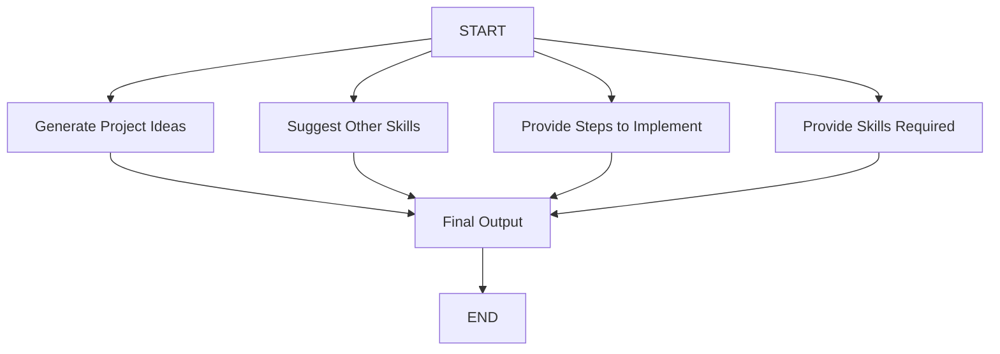
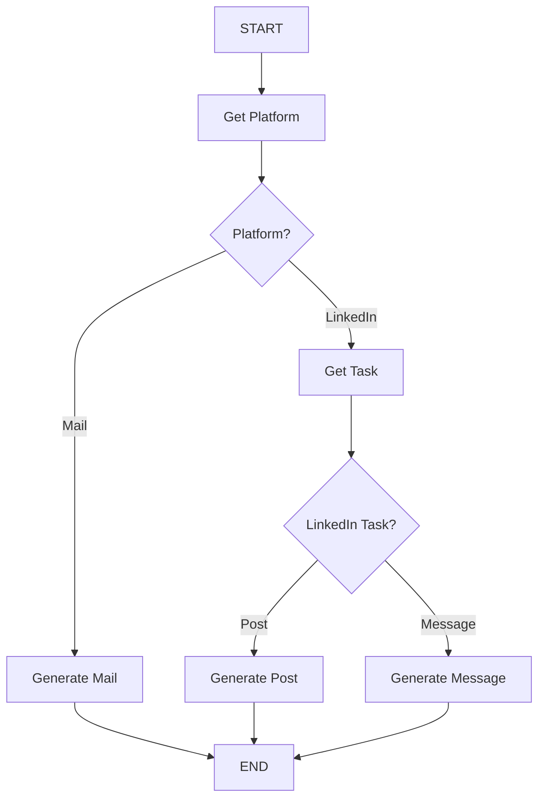
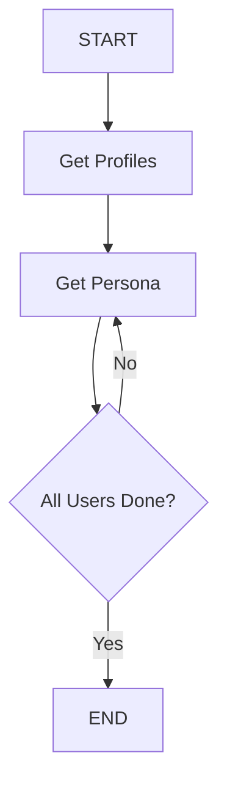

# LangGraph Mini Projects 🕸️
A collection of small-scale LangGraph projects demonstrating various patterns, workflows, and use cases for building stateful, multi-actor applications with LangChain.

## 📂 Projects Overview
| Project Name | Description | Key Concepts | Status | Live Demo |
|--------------|-------------|--------------|--------|-----------|
| `P1: Research Paper Summarizer` | Automated research paper discovery and summarization using Semantic Scholar API | API integration, sequential workflows | ✅ Complete | - |
| `P2: YouTube Video Summarizer` | Extract and summarize YouTube video content with optional Q&A generation | External APIs, conditional processing | ✅ Complete | [🚀 Try it](https://you-tube-summerizer-by-swarup.streamlit.app/) |
| `P3: Project Idea Generator` | Generate personalized project ideas or provide implementation guides for existing ideas | Parallel processing, structured output | ✅ Complete | [🚀 Try it](https://project-idea-generator-by-swarup.streamlit.app/) |
| `P4: Professional Writing Assistant` | Generate professional emails, LinkedIn posts, and LinkedIn messages with smart platform detection | Conditional routing, structured parsing | ✅ Complete | [🚀 Try it](https://professional-writing-assistant-by-swarup.streamlit.app/) |
| `P5: User Persona Generator` | Generate comprehensive user personas with 13-section framework using iterative processing | Iterative loops, state accumulation | ✅ Complete | [🚀 Try it](https://user-persona-generator-by-swarup.streamlit.app/) |
| `P6: Basic Chat Bot with Memory` | Interactive chatbot with conversation history and session management | State persistence, message handling, Streamlit UI | ✅ Complete | [🚀 Try it](https://chat-bot-v1-by-swarup.streamlit.app/) |
| `P7: Advanced Chat Bot v2.0` | Enhanced chatbot with persistent memory using checkpoints and streaming responses | InMemorySaver, streaming, thread management | ✅ Complete | - |

## 🔄 Project Workflows

### P1: Research Paper Summarizer

### P2: YouTube Video Summarizer 

### P3: Project Idea Generator

### P4: Professional Writing Assistant

### P5: User Persona Generator

### P6: Basic Chat Bot with Memory

### P7: Advanced Chat Bot v2.0

## 🚀 Live Demos

Experience the projects in action:

- **P2 - YouTube Video Summarizer**: [https://you-tube-summerizer-by-swarup.streamlit.app/](https://you-tube-summerizer-by-swarup.streamlit.app/)
- **P3 - Project Idea Generator**: [https://project-idea-generator-by-swarup.streamlit.app/](https://project-idea-generator-by-swarup.streamlit.app/)
- **P4 - Professional Writing Assistant**: [https://professional-writing-assistant-by-swarup.streamlit.app/](https://professional-writing-assistant-by-swarup.streamlit.app/)
- **P5 - User Persona Generator**: [https://user-persona-generator-by-swarup.streamlit.app/](https://user-persona-generator-by-swarup.streamlit.app/)
- **P6 - Basic Chat Bot with Memory**: [https://chat-bot-v1-by-swarup.streamlit.app/](https://chat-bot-v1-by-swarup.streamlit.app/)

## 🛠️ Technologies Used

- **LangGraph** - Stateful workflow orchestration
- **LangChain** - LLM application framework  
- **Python 3.8+** - Programming language
- **HuggingFace API** - Primary LLM provider
- **Streamlit** - Web application framework for demos
- **Additional tools**: Varies by project (web scraping, file processing, etc.)

## 📝 License

This projects are licensed under the MIT License

## 🌟 Acknowledgments

- Thanks to the LangChain team for creating LangGraph
- Inspired by the open-source AI community

## 📞 Contact

- **GitHub**: https://github.com/swarupd07
- **LinkedIn**: https://www.linkedin.com/in/swarup-dhanavade-2065a4280/

---

## ⭐ Star this repository if you find it helpful!
